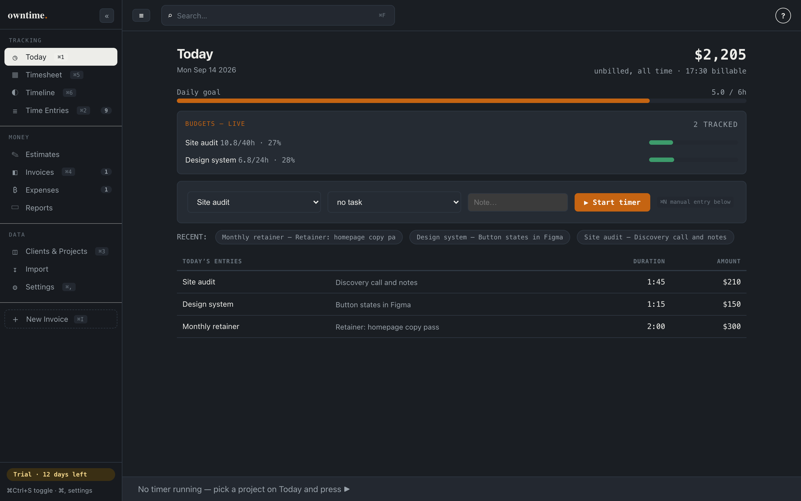
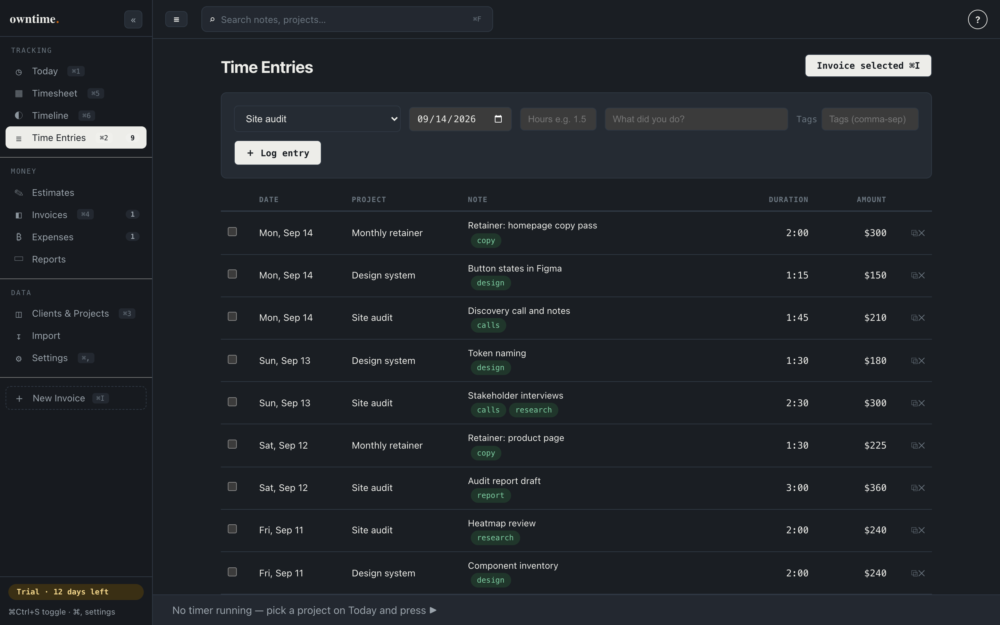
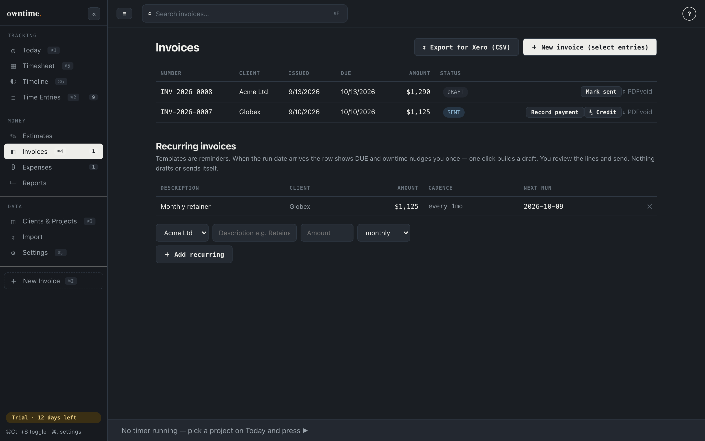
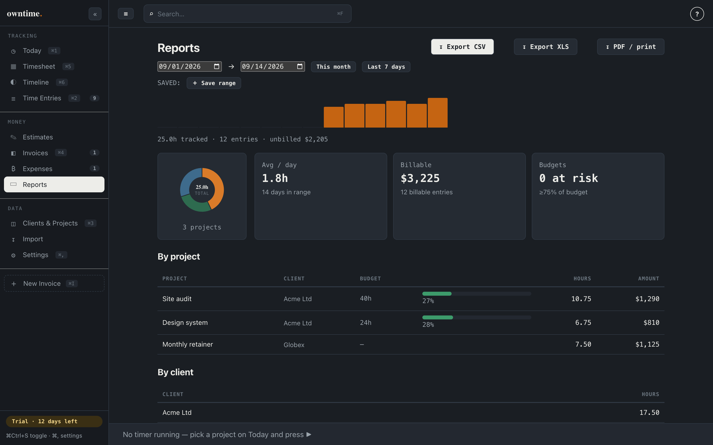
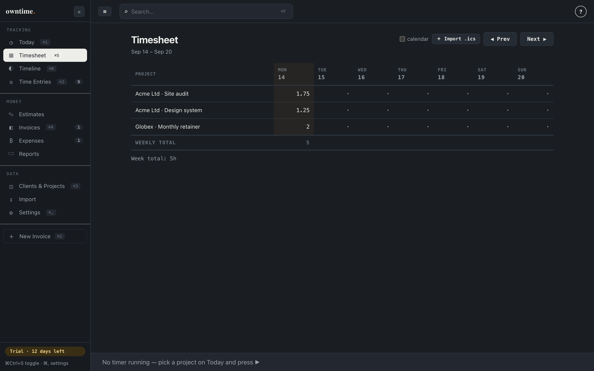
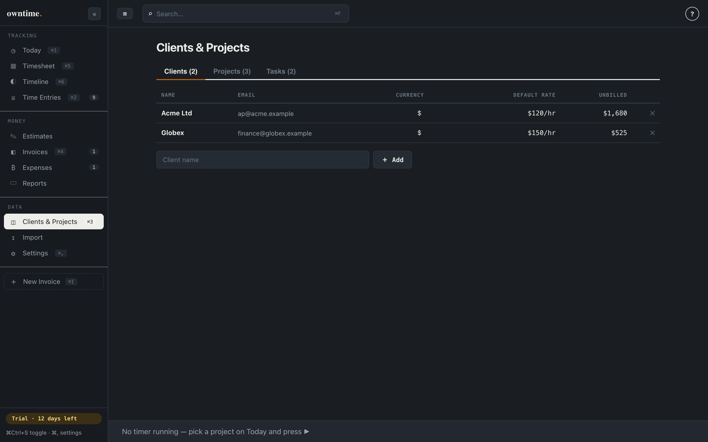

# owntime

**Buy once. Track time. Send invoices. Keep the file.**

[**Download the latest**](https://github.com/amitashwinibhagat/owntime-releases/releases/latest) &nbsp;·&nbsp; [owntime.click](https://owntime.click) &nbsp;·&nbsp; [Help](https://owntime.click/help) &nbsp;·&nbsp; [Changelog](https://owntime.click/changelog)

---

## What it is

owntime is a Mac app for tracking billable time and turning it into invoices. It is for solo consultants and small studios, the people who bill by the hour and send the invoice themselves.

It is not a subscription. You pay once, and the app is yours. There is no account to create, no server that can go down, and no way for the price to move on a copy you already bought. Your entire timesheet is a single SQLite file at `~/Documents/owntime/timesheet.db`, so you can copy it, back it up, sync it with iCloud or Dropbox, or open it in any SQLite browser.

## Screenshots

<table>
<tr>
<td width="50%"> <b>Today.</b> Start a timer in one second, or press the global hotkey from any app. The week's billable total is right there.</td>
<td width="50%"> <b>Time entries.</b> Pick what you are billing. Invoiced rows carry a stamp, so nothing gets billed twice.</td>
</tr>
<tr>
<td width="50%"> <b>Invoices.</b> Built from your tracked time, with your letterhead, tax and terms. Export a PDF or print it.</td>
<td width="50%"> <b>Reports.</b> Hours and billed value per project, cost, margin and effective rate. The cost column is internal and never prints.</td>
</tr>
<tr>
<td width="50%"> <b>Timesheet.</b> A week at a glance. Every cell is editable, for the days you would rather reconstruct on Friday.</td>
<td width="50%"> <b>Clients and projects.</b> Rates, hours budgets and cost rates live here. Projects can be renamed to suit your trade.</td>
</tr>
</table>

## The loop

1. **Track.** Start a timer, press the global hotkey, or log hours by hand.
2. **Pick the entries.** Filter to a client or a date range and select what is ready to bill.
3. **Make the invoice.** One payment, your letterhead, your tax, a PDF you can send.
4. **Mark it paid.** Record what arrived, in parts if it came in parts. Its time stops being unbilled.

## What you get

**Tracking**
- Timer with a global hotkey and a menu bar control
- Idle detection that asks whether to keep or trim the time, instead of guessing
- Weekly timesheet grid, editable in place
- Tags, and notes that autocomplete from that project's history
- Rounding for invoicing, daily goal, optional pomodoro nudge
- Optional passive timeline that records window titles locally, off by default

**Money**
- Invoices built from tracked time, exported as PDF with your letterhead, tax and terms
- Estimates that convert into an invoice once they are accepted
- Expenses with receipts, billable on to the client
- Recurring retainer reminders with a one click draft
- Part payments and credit notes
- Hours budgets with warnings at 75, 80, 90 and 100 percent, on screen and by email
- Reports with cost and margin, plus saved date presets
- Exports: CSV, Excel, PDF, and a CSV that Xero imports
- Payment links you already use (UPI, Stripe) can print on the invoice

**Your data**
- One SQLite file you own, readable by any SQLite browser
- Backups every six hours, newest twenty kept, plus an optional mirror to your own R2 or S3 bucket
- Restore any backup, and the restore is recorded in the activity log
- Import Harvest, Toggl, Clockify or FreshBooks history as a CSV, with a dry run preview first
- Import a plain list of clients and projects, no time entries needed
- An activity log of what changed, local only
- A local command line tool for starting and stopping the timer, if you want one

## What it is not

Stated plainly, because it saves everyone time:

- **Mac only.** macOS 12 or later, Apple silicon. No Windows or Linux build yet.
- **No phone app.** The timer lives on the machine you work on.
- **No team live editing.** Each person has their own file. One writer at a time per file.
- **No forecasting or scheduling.** There is no Harvest Forecast equivalent here.
- **Nothing sends itself.** Recurring invoices are reminders with a one click draft. You always press the button.
- **Budgets are hours, not money.** Money budgets need constant updating and would be wrong within a month.
- **No card processing.** Your own payment links can print on the invoice, but owntime does not handle money.
- **No SSO, no team rollup.** Those need a server, and a server is the thing this app is built to avoid.

## Download

**[Get the latest release](https://github.com/amitashwinibhagat/owntime-releases/releases/latest)**

Each release attaches three files:

| Asset | What it is for |
|---|---|
| `owntime_<version>_aarch64.dmg` | The app. Open it and drag owntime into Applications. |
| `owntime_<version>_aarch64.app.tar.gz` | The bundle the in-app updater downloads. |
| `owntime_<version>_aarch64.app.tar.gz.sig` | The signature that verifies that bundle. |

## Install

1. Open the `.dmg`.
2. Drag **owntime** into **Applications**.
3. Open it. The 14 day trial starts the first time you open the app, not when you download it.

Every build is signed with a Developer ID (`DataDab LLP`) and notarized by Apple, so it opens normally and macOS does not warn about it. If your Mac does ask, that is Gatekeeper reacting to a direct download rather than an App Store purchase, and right click then Open clears it once.

There is no email wall, no account, and no sign up. The trial is the whole product.

## Your data

- **File:** `~/Documents/owntime/timesheet.db`, plus receipts in `~/Documents/owntime/receipts/`
- **Backups:** every six hours of use, newest twenty kept, in `~/Documents/owntime/backups/`
- **Offline:** it works with no connection at all, forever
- **No telemetry, no analytics, no account.** The only times owntime touches the network are activating a licence once, checking for updates when you ask, mirroring to your own bucket if you set one up, and sending a budget email if you set that up
- **Leaving:** copy the file, or export everything as JSON. Delete the folder and you are gone, with nothing left on our side

## Price

**$99 once** during early bird, then $149. One licence covers up to three people on up to three Macs. A six person studio buys two licences, once, and that is the end of it. Updates are free through v1.x, and there is a 30 day refund.

[Buy a licence](https://owntime.click/pricing) · [Licence terms](https://owntime.click/legal) · [Privacy](https://owntime.click/privacy)

## This repository

This repo carries builds and release notes, nothing else. The application source is private.

- **Release notes:** the [releases page](https://github.com/amitashwinibhagat/owntime-releases/releases) and the [changelog](https://owntime.click/changelog)
- **Help:** 35 pages at [owntime.click/help](https://owntime.click/help), covering everything above in detail
- **Questions:** [contact@owntime.click](mailto:contact@owntime.click). One person reads it, usually the same day
